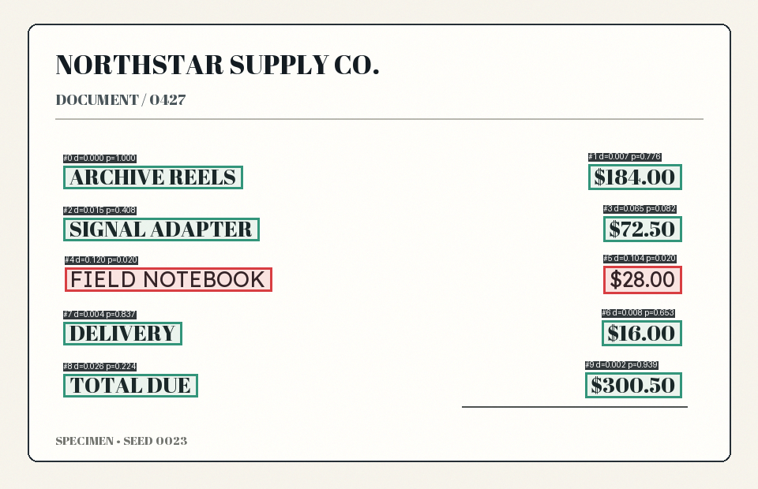
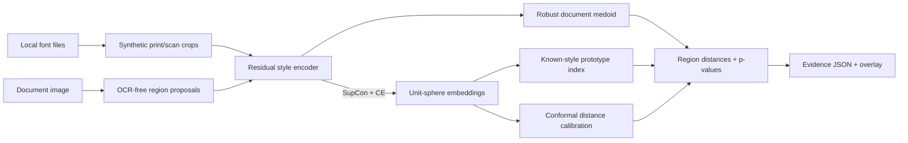

<div align="center">

# Fontprint

### Find the line that does not belong.

**Open-set typography anomaly detection for document forensics.**
Metric learning turns word crops into a font-style fingerprint, then calibrated inference highlights regions that disagree with the document's dominant typography.


</div>

> [!IMPORTANT]
> Fontprint surfaces **typographic inconsistency evidence**. It does not determine whether a document is authentic, altered, or fraudulent. Treat every result as a review lead, not a verdict.



## Why this is an interesting ML system

Most font classifiers assume every query belongs to one of their training classes. Real document review has the opposite constraint: the substituted font may be completely unknown. Fontprint therefore learns a reusable *style space* and asks a different question:

> “Is this region statistically consistent with the dominant type style in this document?”

That design makes the project more than an image classifier:

- **Metric learning:** a residual CNN is trained with supervised contrastive loss plus an auxiliary classification head.
- **Open-set evaluation:** entire font identities are held out from optimization; pair verification AUROC is reported only on those unseen faces.
- **Uncertainty that means something:** held-out, query-to-medoid split-conformal p-values replace arbitrary “AI confidence” percentages.
- **Weak supervision at scale:** a deterministic Pillow pipeline creates print/scan variation without distributing copyrighted document data.
- **Explainable inference:** every decision includes a box, cosine distance, p-value, reference medoid, and nearest indexed style.
- **Production surface:** typed CLI, FastAPI service, Gradio review desk, ONNX export, Docker, tests, and CI.

## How it works



The medoid comparison is robust while fewer than half of the analyzed regions are anomalous. No OCR text is used, so the signal comes from glyph shape rather than semantic content.

## Quick start

```bash
cd fontprint
python -m venv .venv
source .venv/bin/activate
pip install -e '.[dev,demo]'

# Fetch a pinned 20-face OFL benchmark (or use your own licensed font folder)
python scripts/fetch_ofl_fonts.py --destination data/fonts

# See what fonts are usable
fontprint fonts --root data/fonts --limit 12

# A small end-to-end smoke run (about a few minutes on CPU)
fontprint train --quick --font-root data/fonts

# Generate a fictional test case, inspect it, and save the overlay
fontprint synthesize --output specimen.png --tampered
fontprint analyze specimen.png --checkpoint artifacts/fontprint.pt --overlay evidence.png
```

For a meaningful experiment, use `make train`. The included fetcher pins the Google Fonts repository commit, downloads each face with its OFL license, and writes a checksum manifest. Font files are discovered from standard OS locations, or can be supplied explicitly:

```bash
fontprint train --font-root /path/to/ofl-fonts --font-root /path/to/more-fonts
```

Font files are read locally and never copied into the repository or checkpoint. The generated `data/fonts/manifest.json` records source URLs, upstream commit, licenses, and SHA-256 digests for experiment lineage.

## Use the evidence desk

```bash
fontprint demo --checkpoint artifacts/fontprint.pt
```

The Gradio interface can generate a controlled substitution, accept a document image, and show both the visual overlay and auditable JSON evidence.

## Serve the API

```bash
pip install -e '.[api]'
fontprint serve --checkpoint artifacts/fontprint.pt

curl -X POST 'http://localhost:8000/v1/analyze?include_overlay=false' \
  -F 'image=@specimen.png'
```

Interactive OpenAPI docs are available at `http://localhost:8000/docs`. Uploads are capped at 10 MB and 25 megapixels. `/health` is a liveness endpoint; `/ready` and model endpoints return `503` when no checkpoint is mounted, making readiness observable rather than silently falling back to random weights.

Docker users can place a trained checkpoint at `artifacts/fontprint.pt` and run:

```bash
docker compose up --build
```

## Train and evaluate

All experiment controls live in [`configs/base.yaml`](configs/base.yaml). A run writes two ignored artifacts:

- `artifacts/fontprint.pt` — weights, calibration distribution, prototypes, schema version, and metrics.
- `artifacts/run.json` — resolved config, learning curve, metrics, device, and exact local font paths.

The evaluation intentionally separates two questions:

| Metric | Split | What it tests |
|---|---|---|
| `prototype_accuracy` | Seen font identities, new words/augmentations | Closed-set retrieval sanity |
| `heldout_pair_auroc` | Entirely unseen font identities | Whether the learned distance transfers open-set |
| Same/different distance gap | Seen and held-out | Embedding separation and collapse |
| `calibration_threshold` | Query-to-medoid groups from held-out faces | Operating point for conformal anomaly evidence |

No benchmark numbers are hard-coded into this README. Generate them on a declared font collection and machine, then publish `run.json` with a model release. This avoids presenting local system-font results as a universal benchmark.

## Export for deployment

```bash
pip install -e '.[export]'
fontprint export-onnx --checkpoint artifacts/fontprint.pt --output artifacts/fontprint.onnx
```

The ONNX model emits normalized embeddings with a dynamic batch dimension. A JSON sidecar contains preprocessing dimensions, prototype vectors, conformal calibration scores, and evaluation metadata.

## Repository map

```text
src/fontprint/
├── synthesis.py       # reproducible print/scan simulation + PK sampler
├── preprocessing.py   # word proposals and crop normalization
├── model.py           # residual style encoder
├── losses.py          # supervised contrastive objective
├── calibration.py     # finite-sample conformal p-values
├── index.py           # exact cosine prototype retrieval
├── training.py        # train/evaluate/calibrate pipeline
├── analyzer.py        # document medoid and evidence overlay
├── api.py / demo.py   # FastAPI and Gradio surfaces
└── export.py          # ONNX deployment bundle
```

Deeper design notes live in [Architecture](docs/ARCHITECTURE.md), [Model Card](docs/MODEL_CARD.md), and [Data Card](docs/DATA_CARD.md).

## Research threads

Fontprint is inspired by [Supervised Contrastive Learning](https://arxiv.org/abs/2004.11362), [Font-ProtoNet](https://openaccess.thecvf.com/content_CVPRW_2020/html/w34/Goel_Font-ProtoNet_Prototypical_Network-Based_Font_Identification_of_Document_Images_in_Low_Data_CVPRW_2020_paper.html), the synthetic-to-real motivation in [DeepFont](https://arxiv.org/abs/1507.03196), and the practical treatment of uncertainty in [conformal prediction](https://arxiv.org/abs/2107.07511). It is an independent engineering project, not an implementation claiming parity with those papers.

## Known limitations

- The region proposer is intentionally OCR-free and works best on mostly horizontal Latin text. Supply better boxes from a document-layout model in a downstream integration.
- Multiple legitimate fonts in one document can be flagged. Analyze semantically comparable regions (for example, table rows) for stronger evidence.
- Small crops, handwriting, curved text, decorative display faces, severe blur, and non-Latin scripts are out of scope for v0.1.
- Synthetic augmentation narrows but does not eliminate the sim-to-real gap. A serious deployment needs a representative, consented real-scan validation set.
- Conformal guarantees depend on exchangeability: production images must resemble the calibration setting.

## Responsible use

Fontprint is suitable for research, education, document QA, and triage by trained reviewers. It is not suitable as the sole basis for denying a claim, accusing a person, or making any legal or financial decision. See [SECURITY.md](SECURITY.md) for reporting issues and [CONTRIBUTING.md](CONTRIBUTING.md) for the development workflow.

## License

Code is released under the [MIT License](LICENSE). Users remain responsible for the licenses of fonts and documents they provide.
