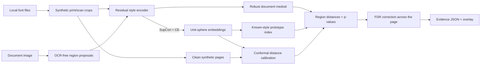

<div align="center">

# Fontprint

### Find the line that does not belong.

**Open-set typography anomaly detection for document forensics.**
Metric learning turns word crops into a font-style fingerprint, then calibrated inference highlights regions that disagree with the document's dominant typography.

[](https://github.com/BAAAAR19/fontprint/actions/workflows/ci.yml)


[Step-by-step guide](docs/USAGE.md) · [Architecture](docs/ARCHITECTURE.md) · [Model card](docs/MODEL_CARD.md) · [Data card](docs/DATA_CARD.md)

</div>

> [!IMPORTANT]
> Fontprint surfaces **typographic inconsistency evidence**. It does not determine whether a document is authentic, altered, or fraudulent. Treat every result as a review lead, not a verdict.


## Why this is an interesting ML system

Most font classifiers assume every query belongs to one of their training classes. Real document review has the opposite constraint: the substituted font may be completely unknown. Fontprint therefore learns a reusable *style space* and asks a different question:

> “Is this region statistically consistent with the dominant type style in this document?”

That design makes the project more than an image classifier:

- **Metric learning:** a residual CNN is trained with supervised contrastive loss plus an auxiliary classification head.
- **Open-set evaluation:** entire font identities are held out from optimization; pair verification AUROC is reported only on those unseen faces.
- **Uncertainty that means something:** split-conformal p-values replace arbitrary “AI confidence” percentages, and calibration is fitted through the deployed inference path so the nominal alpha survives contact with real pages.
- **Weak supervision at scale:** a deterministic Pillow pipeline creates print/scan variation without distributing copyrighted document data.
- **Explainable inference:** every decision includes a box, cosine distance, p-value, reference medoid, and nearest indexed style.
- **Measured, not asserted:** `fontprint benchmark` scores the end-to-end decision on controlled substitutions and publishes the numbers, including the ones that are not flattering.
- **Production surface:** typed CLI, FastAPI service, Gradio review desk, ONNX export, Docker, tests, and CI.

## How it works



The medoid comparison is robust while fewer than half of the analyzed regions are anomalous. No OCR text is used, so the signal comes from glyph shape rather than semantic content. Calibration is fitted on clean pages pushed through that same inference path, and the per-region p-values are corrected across the page before any region is called an outlier.

## Quick start

Full walkthrough with expected output: **[docs/USAGE.md](docs/USAGE.md)**.

```bash
git clone https://github.com/BAAAAR19/fontprint.git
cd fontprint
python -m venv .venv
source .venv/bin/activate
pip install -e '.[dev,demo]'

# Fetch a pinned 20-face OFL benchmark (or use your own licensed font folder)
python scripts/fetch_ofl_fonts.py --destination data/fonts

# See what fonts are usable
fontprint fonts --root data/fonts --limit 12

# A small end-to-end smoke run (about a few minutes on CPU)
fontprint train --quick --font-root data/fonts

# Generate a fictional test case, inspect it, and save the overlay
fontprint synthesize --output specimen.png --tampered
fontprint analyze specimen.png --checkpoint artifacts/fontprint.pt --overlay evidence.png

# Score the whole pipeline, not just the embedding space
fontprint benchmark --checkpoint artifacts/fontprint.pt --font-root data/fonts --markdown
```

For a meaningful experiment, use `make train`. The included fetcher pins the Google Fonts repository commit, downloads each face with its OFL license, and writes a checksum manifest. Font files are discovered from standard OS locations, or can be supplied explicitly:

```bash
fontprint train --font-root /path/to/ofl-fonts --font-root /path/to/more-fonts
```

Font files are read locally and never copied into the repository or checkpoint. The generated `data/fonts/manifest.json` records source URLs, upstream commit, licenses, and SHA-256 digests for experiment lineage.

## Use the evidence desk

```bash
fontprint demo --checkpoint artifacts/fontprint.pt
```

The Gradio interface can generate a controlled substitution, accept a document image, and show both the visual overlay and auditable JSON evidence.

## Serve the API

```bash
pip install -e '.[api]'
fontprint serve --checkpoint artifacts/fontprint.pt

curl -X POST 'http://localhost:8000/v1/analyze?include_overlay=false' \
  -F 'image=@specimen.png'
```

Interactive OpenAPI docs are available at `http://localhost:8000/docs`. Uploads are capped at 10 MB and 25 megapixels. `/health` is a liveness endpoint; `/ready` and model endpoints return `503` when no checkpoint is mounted, making readiness observable rather than silently falling back to random weights.

Docker users can place a trained checkpoint at `artifacts/fontprint.pt` and run:

```bash
docker compose up --build
```

## Measured results

Twenty OFL faces, sixteen trained on and four reserved before the first optimizer
step. Forty fictional invoices per run — half with exactly one substituted line, half
internally consistent — scored through the deployed path: OCR-free proposals, encoder,
page medoid, conformal p-values, FDR control at `alpha = 0.05`. Seed 101, Apple M1 CPU/MPS.

| Split | Region AUROC | Region precision | Region recall | Document recall | Document FPR |
|---|---|---|---|---|---|
| **4 faces never trained on** | 0.838 | 0.833 | 0.167 | 0.20 | 0.05 |
| All 20 faces | 0.975 | 0.774 | 0.727 | 0.80 | 0.30 |

Representation metrics from the same run: `prototype_accuracy` 0.945 on seen faces,
`heldout_pair_auroc` 0.813 on unseen ones.

Read the top row as the honest one. Against a face the model has never seen, the
distance still ranks substitutions well above consistent text, and the flags it does
raise are right five times out of six — but it only catches about one substitution in
six, and a quiet page is weak evidence of consistency.

### What the benchmark caught

Every number below is from `fontprint benchmark` on the held-out faces. Each finding
was a defect the representation metrics could not see.

| Finding | Before | After |
|---|---|---|
| Calibration fitted on word crops is not exchangeable with page regions | 36% of consistent regions flagged at a nominal 5% | 5.1% |
| One alpha per region is not one alpha per page | 50% document false-positive rate | 5% |
| Wide regions letterbox into unusable crops | FDR control flagged nothing | 0.83 precision at 0.17 recall |

The multiple-testing correction is the clearest of the three, because it costs nothing:

| Correction | Document FPR | Region precision | Region recall |
|---|---|---|---|
| `none` | 0.30 | 0.185 | 0.167 |
| `bh` (default) | 0.05 | 0.833 | 0.167 |
| `holm` | 0.05 | 0.833 | 0.167 |

Not a single true detection was lost; only false ones were removed. Benjamini-Hochberg
is the default because a reviewer works through a list of boxes and cares about the
share of them that are wrong. `--correction holm` gives a strict family-wise guarantee,
and `--correction none` returns the raw per-region behaviour for triage.

Reproduce the top row with:

```bash
fontprint benchmark -m artifacts/fontprint.pt --proposals --documents 40 \
  --font-root data/fonts/playfairdisplay --font-root data/fonts/rubik \
  --font-root data/fonts/spacemono --font-root data/fonts/spectral
```

Numbers move with the font collection, the seed, and the machine. Publish `run.json`
and `benchmark.json` alongside any claim rather than trusting the table above.

## Train and evaluate

All experiment controls live in [`configs/base.yaml`](configs/base.yaml). A run writes two ignored artifacts:

- `artifacts/fontprint.pt` — weights, calibration distribution, prototypes, schema version, and metrics.
- `artifacts/run.json` — resolved config, learning curve, metrics, device, and exact local font paths.

The evaluation intentionally separates two questions:

| Metric | Split | What it tests |
|---|---|---|
| `prototype_accuracy` | Seen font identities, new words/augmentations | Closed-set retrieval sanity |
| `heldout_pair_auroc` | Entirely unseen font identities | Whether the learned distance transfers open-set |
| Same/different distance gap | Seen and held-out | Embedding separation and collapse |
| `calibration_threshold` | Clean pages from held-out faces, cut by the production proposer | Operating point for conformal anomaly evidence |
| `word_group_threshold` | Query-to-medoid word groups | Diagnostic: how far word-crop calibration drifts from the page-matched one |

Calibration deliberately runs through the deployed inference path. Conformal validity needs the calibration and test scores to be exchangeable, and word crops are not exchangeable with regions the proposer cuts out of a rendered page — that mismatch alone turned a nominal 5% level into a measured 36%.

Then, because a page carries one hypothesis per region, region p-values are corrected across the page before any decision is taken. Without that step a ten-region document raises a false alarm about 40% of the time no matter how well calibrated each region is.

## Export for deployment

```bash
pip install -e '.[export]'
fontprint export-onnx --checkpoint artifacts/fontprint.pt --output artifacts/fontprint.onnx
```

The ONNX model emits normalized embeddings with a dynamic batch dimension. A JSON sidecar contains preprocessing dimensions, prototype vectors, conformal calibration scores, and evaluation metadata.

## Repository map

```text
src/fontprint/
├── synthesis.py       # reproducible print/scan simulation + PK sampler
├── preprocessing.py   # word proposals and crop normalization
├── model.py           # residual style encoder
├── losses.py          # supervised contrastive objective
├── calibration.py     # finite-sample conformal p-values
├── index.py           # exact cosine prototype retrieval
├── metrics.py         # rank-based AUROC and PR helpers
├── training.py        # train/evaluate/calibrate pipeline
├── analyzer.py        # document medoid and evidence overlay
├── benchmark.py       # end-to-end detection benchmark
├── api.py / demo.py   # FastAPI and Gradio surfaces
└── export.py          # ONNX deployment bundle
```

Deeper design notes live in [Architecture](docs/ARCHITECTURE.md), [Model Card](docs/MODEL_CARD.md), and [Data Card](docs/DATA_CARD.md).

## Research threads

Fontprint is inspired by [Supervised Contrastive Learning](https://arxiv.org/abs/2004.11362), [Font-ProtoNet](https://openaccess.thecvf.com/content_CVPRW_2020/html/w34/Goel_Font-ProtoNet_Prototypical_Network-Based_Font_Identification_of_Document_Images_in_Low_Data_CVPRW_2020_paper.html), the synthetic-to-real motivation in [DeepFont](https://arxiv.org/abs/1507.03196), and the practical treatment of uncertainty in [conformal prediction](https://arxiv.org/abs/2107.07511). It is an independent engineering project, not an implementation claiming parity with those papers.

## Known limitations

- The region proposer is intentionally OCR-free and works best on mostly horizontal Latin text. Supply better boxes from a document-layout model in a downstream integration.
- Multiple legitimate fonts in one document can be flagged. Analyze semantically comparable regions (for example, table rows) for stronger evidence.
- Small crops, handwriting, curved text, decorative display faces, severe blur, and non-Latin scripts are out of scope for v0.1.
- Synthetic augmentation narrows but does not eliminate the sim-to-real gap. A serious deployment needs a representative, consented real-scan validation set.
- Conformal guarantees depend on exchangeability: production images must resemble the calibration setting.
- **Recall is low by design and low in fact.** With the error rate controlled at the page level, the benchmark catches roughly one substitution in five on faces the model has never seen. A clean report is weak evidence of consistency, not proof of it. Use `--correction none` when you would rather review extra regions than miss one.
- Regions wider than 8:1 are skipped rather than analyzed, because letterboxing destroys their glyph detail. A full table row therefore reaches the encoder as several word-level regions, and very wide single-line banners may go unexamined.

## Responsible use

Fontprint is suitable for research, education, document QA, and triage by trained reviewers. It is not suitable as the sole basis for denying a claim, accusing a person, or making any legal or financial decision. See [SECURITY.md](SECURITY.md) for reporting issues and [CONTRIBUTING.md](CONTRIBUTING.md) for the development workflow.

## License

Code is released under the [MIT License](LICENSE). Users remain responsible for the licenses of fonts and documents they provide.
